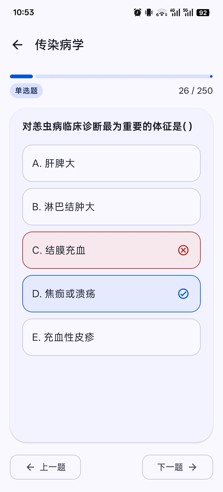
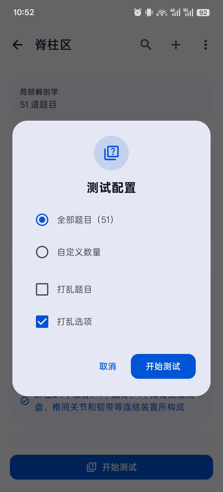
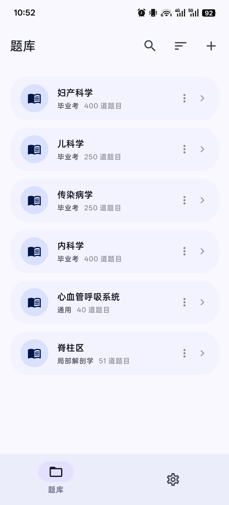
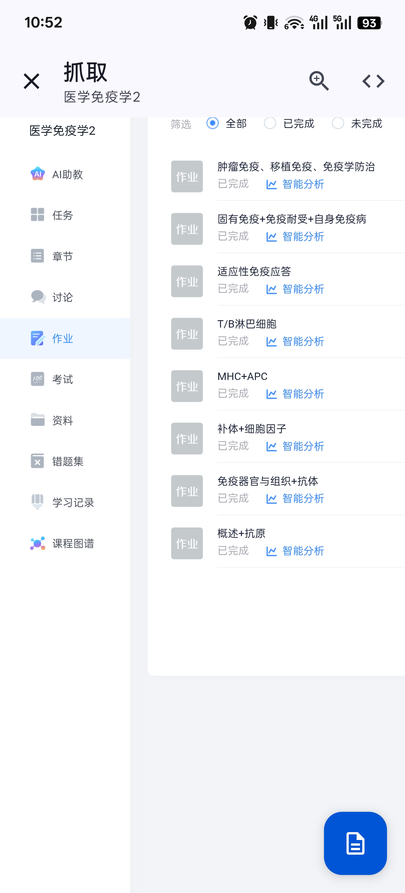
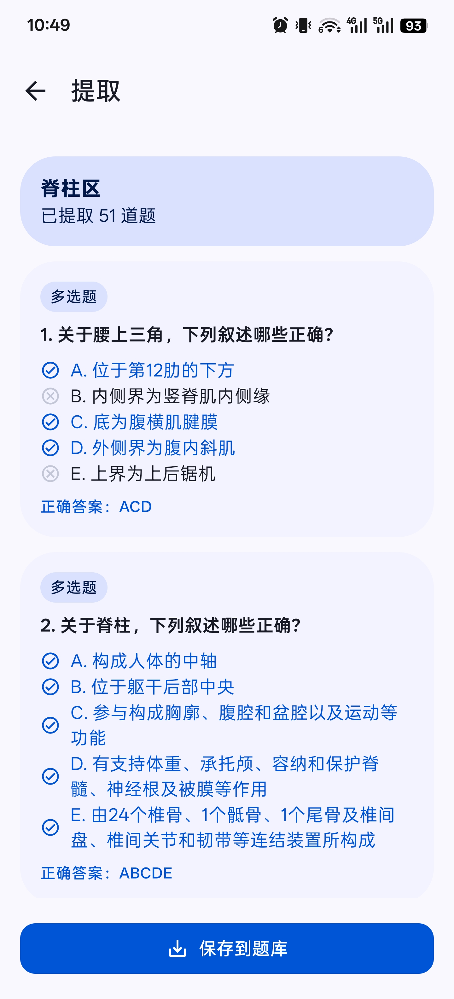

# NekoMemo

NekoMemo 是一款背题软件，可从学习通网页提取题库，帮助背题练习喵~

## 功能特性

- **网页解析**：从学习通网页中解析并提取题库
- **题库管理**：多题库管理，支持单选题、单选题、填空题
- **练习模式**：支持测试全部或部分题目，支持打乱题目或选项
- **分类标签**
- **导入/导出**：备份题库或与他人分享
- **Material 3**

## 截图

 
 

## 使用说明

1. 在题库页右上角加号，从学习通抓取
2. 登录学习通，找到课程的作业详情页面
3. 点击右下角按钮，提取题目
4. 保存到题库
5. 回到题库页，刷题测试喵~

## 许可协议
    Copyright 2026 JamGmilk
    MIT License
